## Database Design
DBMS: MYSQL
- and will use central server and scale vertical when number of users increased (100000)
### Modules :
#### 1- users and profiles 
- USERS
- IDENTITY_AUTHENTICATIONS 
- ADMINS
- FREELANCER_PROFILES
- SKILLS
- FREELANCER_SKILLS
- PROJECTS
- BRAND_OWNER_PROFILES
- USER_BANS

#### 2- Job offers and proposals  
- JOB_OFFERS
- PROPOSALS

#### 3- Payments and Balance 
- PENDING_BALANCES (to hold job escrow)
- USER_BALANCES
- PLATFORM_TRANSACTIONS (for show all transactions)
- PAYMENT_GATEWAY_LOGS (to tracking all gateway transactions)
- WITHDRAWALS to tracking withdrawals and approve or denied  it 
- (create indexing)
####  4- Ratting and Reviews
- RATINGS
- REVIEWS

#### 5- Chatting system 
- CONVERSATIONS
- MESSAGES
- MESSAGE_ATTACHMENTS

#### notification 

-----

```mermaid
erDiagram
    USERS {
        bigint id PK
        string first_name
        string last_name
        string email UK
        string phone_number
        string country
        string region
        string gender
        string account_image
        enum account_type "brand_owner, freelancer"
        date birthday
        boolean verified "true, false"
        string provider "Nullable"
        string provider_id "Nullable"
        timestamp created_at
        timestamp updated_at
    }
    IDENTITY_AUTHENTICATIONS {
        bigint id PK
        bigint user_id FK
        string front_side
        string back_side
        string selfie_with_front_id
        enum status "pending, denied, accepted"
        timestamp created_at
        timestamp updated_at
    }
    ADMINS {
        bigint id PK
        string name
        string email UK
        string password
        enum role "admin, moderator"
        timestamp created_at
        timestamp updated_at
    }
    FREELANCER_PROFILES {
        bigint id PK
        bigint user_id FK
        text bio "Nullable"
        string specialization "Nullable"
        string job_title "Nullable"
        timestamp created_at
        timestamp updated_at
    }
    SKILLS {
        bigint id PK
        string name
        string category "Nullable"
        timestamp created_at
        timestamp updated_at
    }
    FREELANCER_SKILLS {
        bigint freelancer_profile_id FK
        bigint skill_id FK
        int proficiency_level "Nullable"
        timestamp created_at
        timestamp updated_at
    }
    PROJECTS {
        bigint id PK
        bigint freelancer_profile_id FK
        string title
        text description
        string thumbnail
        string image
        json skills
        string category
        string link
        timestamp created_at
        timestamp updated_at
    }
    BRAND_OWNER_PROFILES {
        bigint id PK
        bigint user_id FK
        string company_name
        string industry
        string website "Nullable"
        text description "Nullable"
        timestamp created_at
        timestamp updated_at
    }
    USER_BANS {
        bigint id PK
        bigint user_id FK
        bigint banned_by FK "References ADMINS.id"
        timestamp expires_at "Nullable"
        text reason "Nullable"
        int times_banned
        timestamp created_at
        timestamp updated_at
    }
    JOB_OFFERS {
        bigint id PK
        bigint user_id FK 
        string title
        text description
        decimal budget
        string link 
        json required_skills
        datetime deadline
        enum status "open, in_progress, completed, cancelled"
        timestamp created_at
        timestamp updated_at
    }
    PROPOSALS {
        bigint id PK
        bigint job_offer_id FK
        bigint user_id FK 
        text cover_letter
        decimal proposed_price
        datetime estimated_delivery
        string attachments
        enum status "pending, accepted, rejected"
        timestamp created_at
        timestamp updated_at
    }
    PLATFORM_TRANSACTIONS {
        bigint id PK
        bigint user_id FK "References USERS.id, Nullable for platform"
        decimal amount
        enum type "deposit, escrow_hold, release, commission, withdraw, refund"
        enum payment_method "bank_card, mobile_wallet, balance"
        string gateway_transaction_id "Nullable"
        enum status "pending, completed, failed"
        timestamp created_at
        timestamp updated_at
    }
    USER_BALANCES {
        bigint id PK
        bigint user_id FK "References USERS.id"
        decimal balance "Default 0.00, Available funds"
        timestamp created_at
        timestamp updated_at
    }
    PENDING_BALANCES {
        bigint id PK
        bigint job_offer_id FK "References JOB_OFFERS.id"
        bigint freelancer_id FK "References USERS.id"
        decimal amount "Funds held for freelancer"
        enum status "pending, released"
        decimal commission "Platform's 20% cut"
        timestamp created_at
        timestamp updated_at
    }
    PAYMENT_GATEWAY_LOGS {
        bigint id PK
        bigint transaction_id FK
        string gateway_transaction_id "Nullable"
        json request_data "Nullable"
        json response_data "Nullable"
        enum status "success, failure"
        timestamp created_at
        timestamp updated_at
    }
    WITHDRAWALS {
        bigint id PK
        bigint user_id FK
        decimal amount
        enum status "pending, approved, failed"
        enum destination_type "bank, mobile_wallet"
        string destination_details
        timestamp created_at
        timestamp updated_at
    }
    RATINGS {
        bigint id PK
        bigint job_offer_id FK "References JOB_OFFERS.id"
        bigint rater_id FK "References USERS.id (rater)"
        bigint ratee_id FK "References USERS.id (ratee)"
        int recommend_to_others "1-5 rating"
        int professionalism_in_dealing "1-5 rating"
        int speed_of_communication "1-5 rating"
        int quality_of_work "1-5 rating"
        int expertise_in_field "1-5 rating"
        int respect_for_deadline "1-5 rating"
        int willingness_to_work_again "1-5 rating"
        timestamp created_at
        timestamp updated_at
    }

    REVIEWS {
        bigint id PK
        bigint rating_id FK "References RATINGS.id"
        text review_text
        timestamp created_at
        timestamp updated_at
    }
    CONVERSATIONS {
        bigint id PK
        bigint job_offer_id FK "References JOB_OFFERS.id, Nullable"
        timestamp created_at
        timestamp updated_at
    }

    MESSAGES {
        bigint id PK
        bigint conversation_id FK "References CONVERSATIONS.id"
        bigint sender_id FK "References USERS.id"
        text message_text "Nullable"
        boolean is_read "Default: false"
        timestamp created_at
        timestamp updated_at
    }

    MESSAGE_ATTACHMENTS {
        bigint id PK
        bigint message_id FK "References MESSAGES.id"
        enum media_type "image, video"
        string media_url
        bigint file_size "Nullable"
        int duration "Nullable, for videos"
        timestamp created_at
        timestamp updated_at
    }
    NOTIFICATIONS {
        bigint id PK
        bigint user_id FK "References USERS.id"
        string type "e.g., new_message, job_accepted"
        bigint notifiable_id "Nullable"
        string notifiable_type "Nullable, e.g., Messages, JobOffers"
        json data "Nullable, additional details"
        timestamp read_at "Nullable"
        timestamp created_at
        timestamp updated_at
    }



    USERS ||--o{ IDENTITY_AUTHENTICATIONS : has
    USERS ||--o| FREELANCER_PROFILES : has
    FREELANCER_PROFILES ||--o{ FREELANCER_SKILLS : has
    SKILLS ||--o{ FREELANCER_SKILLS : included_in
    FREELANCER_PROFILES ||--o{ PROJECTS : has
    USERS ||--o| BRAND_OWNER_PROFILES : has
    ADMINS ||--o{ USER_BANS : issued_by
    USERS ||--o{ USER_BANS : has
    USERS ||--o{ JOB_OFFERS : creates
    JOB_OFFERS ||--o{ PROPOSALS : receives
    USERS ||--o{ PROPOSALS : submits
    USERS ||--o{ PLATFORM_TRANSACTIONS : performs
    USERS ||--o| USER_BALANCES : has
    JOB_OFFERS ||--o{ PENDING_BALANCES : holds
    PLATFORM_TRANSACTIONS ||--o{ PAYMENT_GATEWAY_LOGS : logged_via
    USERS ||--o{ WITHDRAWALS : requests
    JOB_OFFERS ||--o{ RATINGS : rated_for
    USERS ||--o{ RATINGS : gives
    USERS ||--o{ RATINGS : receives
    RATINGS ||--o| REVIEWS : has
    CONVERSATIONS ||--o{ MESSAGES : contains
    USERS ||--o{ MESSAGES : sends
    MESSAGES ||--o{ MESSAGE_ATTACHMENTS : has
    USERS ||--o{ NOTIFICATIONS : receives
    NOTIFICATIONS ||--o| MESSAGES : relates_to
    NOTIFICATIONS ||--o| JOB_OFFERS : relates_to
    NOTIFICATIONS ||--o| PROPOSALS : relates_to
    NOTIFICATIONS ||--o| PLATFORM_TRANSACTIONS : relates_to
    NOTIFICATIONS ||--o| RATINGS : relates_to
    
```

