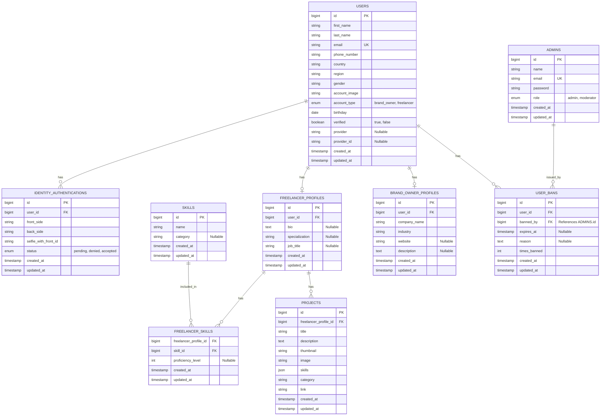

## Database Design
DBMS: MYSQL
- and will use central server and scale vertical when number of users increased (100000)
### Modules :
#### 1- users and profiles 
- USERS
- IDENTITY_AUTHENTICATIONS 
- ADMINS
- FREELANCER_PROFILES
- SKILLS
- FREELANCER_SKILLS
- PROJECTS
- BRAND_OWNER_PROFILES
- USER_BANS

#### 2- 

-----

